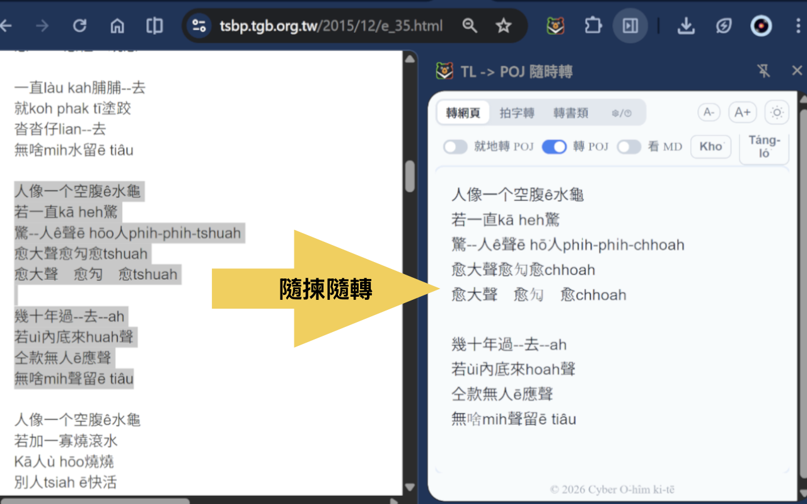
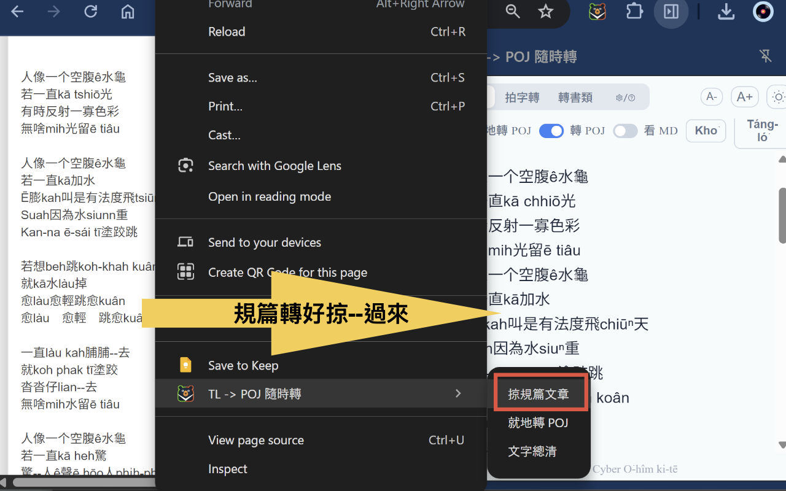
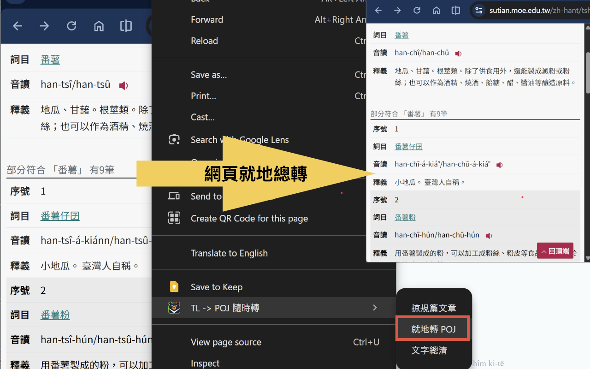
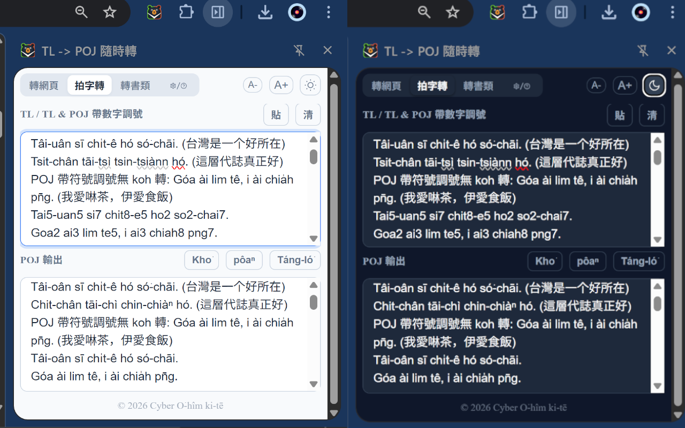
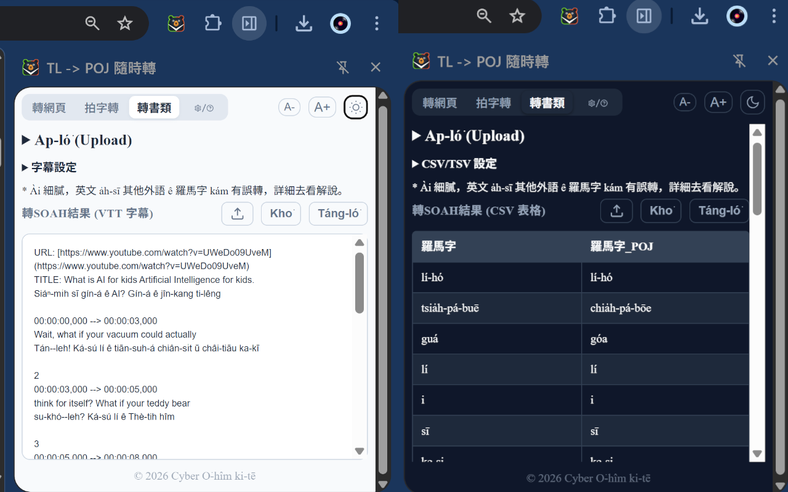

# Screenshots / Hip 幕

## Scan Mode / 轉網頁

### Selected Text Conversion / 揀選文字轉換

*Select text on any webpage to verify and convert it in the side panel.*
*直接 tī 網頁頂懸揀文字，tī 邊欄確認 kap 轉換。*

### Full Article Extraction / 掠規篇文章

*Extract main content from articles for reading.*
*直接掠網頁文章ê主要內容來讀。*

### Live Conversion / 網頁就地轉

*Convert TL to POJ directly on the webpage.*
*直接 tī 網頁原位 kā TL 轉做 POJ。*

---

## Type Mode / 拍字轉

### Real-time Typing / 即時拍字轉換

*Type TL with tone numbers or diacritics and get POJ instantly.*
*拍 TL (數字調號 a̍h-sī 符號調號) 隨變做 POJ 符號調號。*
*POJ 數字調號原仔 thang 轉 POJ 符號調號。*

---

## File Mode / 書類處理

### File Conversion / 轉檔案

*Convert various file formats including CSV, JSON, SRT/VTT.*
*轉各種書類檔案格式，包括TXT, MD, CSV/TSV, JSON, SRT/VTT 影片字幕等等。*
